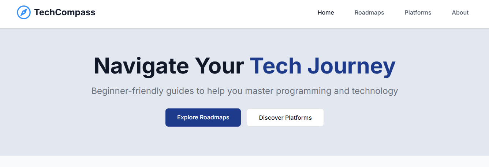

# TechCompass 🧭

**Navigate Your Tech Journey** – A beginner-friendly platform to help you master programming and technology through structured roadmaps and curated resources.



## 🌟 About

**TechCompass** is designed to guide beginners who are eager to start their journey in programming and technology. It provides:

- 📚 **Structured Roadmaps**: Step-by-step guides for various tech domains.
- 🔗 **Curated Learning Resources**: Recommended courses, websites, and platforms to learn effectively.
- 🧭 **Career Pathways**: Guidance on potential career paths in the tech industry.

Whether you're exploring web development, data science, or software engineering, TechCompass helps you stay on track.

## 🚀 Features

- Clean, modern UI using **React** and **Tailwind CSS**
- Interactive roadmaps for different programming tracks
- Curated learning platforms and tools
- Recommendations for real-world career progression

## 🛠️ Built With

- [React](https://reactjs.org/)
- [Tailwind CSS](https://tailwindcss.com/)
- [Vite](https://vitejs.dev/)

## 📦 Installation

## 🌐 Live Demo

Check out the live version of TechCompass here:  
🔗 [https://tech-compass.netlify.app](https://tech-compass.netlify.app)

## 🛠️ Local Setup (Optional)

To run the project locally:

```bash
git clone https://github.com/your-username/techcompass.git
cd techcompass
npm install
npm run dev
